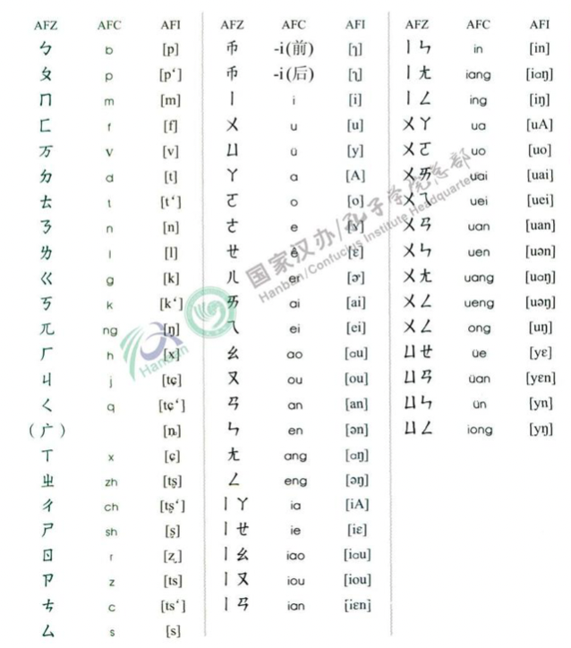
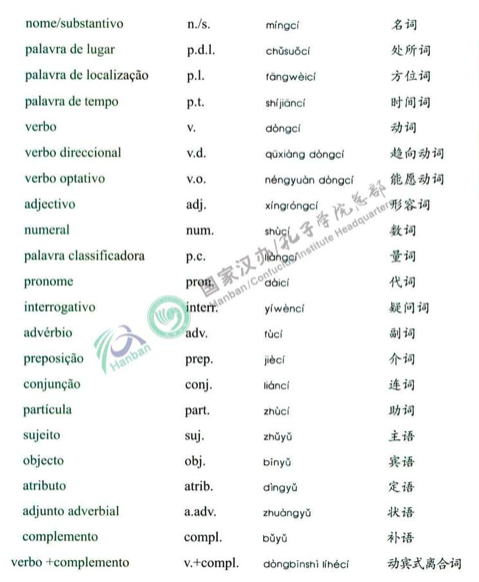
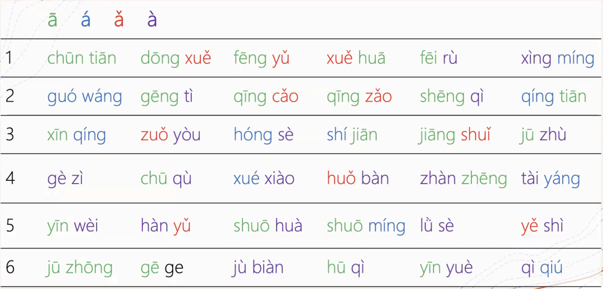
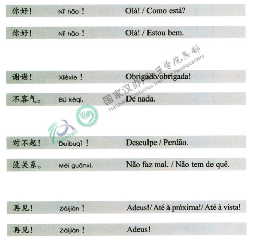
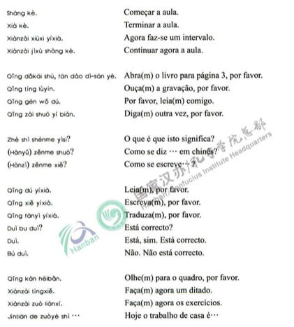

# Lição 0 第 0 课 dì-líng kè
*Curso de mandarim UFPB/Dalian* 

*Notas de estudo organizadas por Gustavo Oliveira*

-- 
**Tema da lição:** fonética; romanização; _hanyu pinyin_; pronúncia

## Tabela fonética

## Termos gramaticais

## Treinamento de tons

## Expressões de cortesia

## Expressões de sala de aula

## Como digitar tons no macOS

- Com _keyboard input_ **ABC-Extended** use as combinações abaixo.
	- 1o. tom: ⌥ (option) + a
	- 2o. tom: ⌥ (option) + e
	- 3o. tom: ⌥ (option) + v
	- 4o. tom: ⌥ (option) + ~   

- Exemplo: 
	- ⌥ (option) + a + "a"  = ā 
	- ⌥ (option) + e + "a"  = á
	- ⌥ (option) + v + "a"  = ǎ
	- ⌥ (option) + ~ + "a"  = à

- Nota: com _keyboard input_ **Brazilian** todos podem ser reproduzdos diretamente, exceto o sinal do 3o. tom.

## Encoding

- Para Pinyin e Unicode, veja [aqui](http://www.pinyin.info/tools/index.html).
- Pinyin "ǚ": (u + umlaut + caron/háček) :: `chr(474)`
- [Cantoneseplus](https://cantoneseplus.com): conversão (pinyin <-> hanzi) :: inputs devem ser nome + tom indicado por número (exemplo: hěn = hen3)