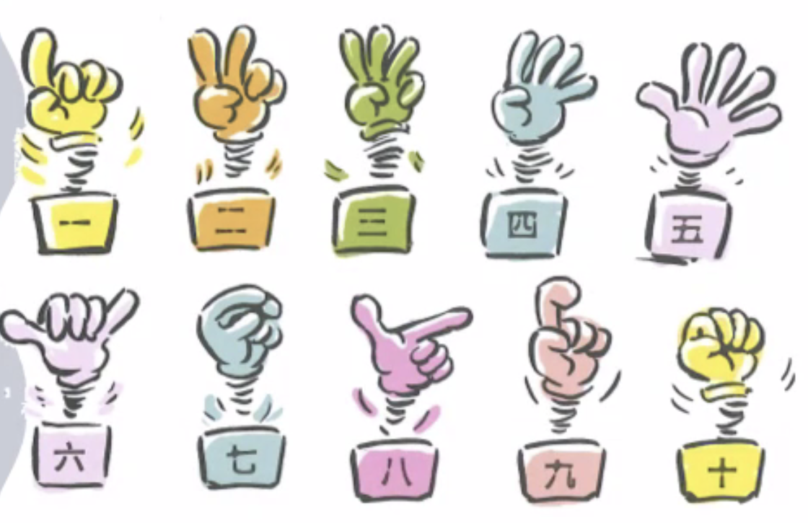
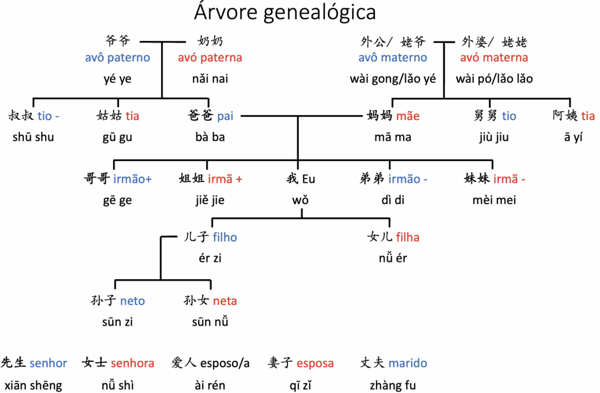

# Lição 3 第三课 dì-sān kè
*Curso de mandarim UFPB/Dalian* 

*Notas de estudo organizadas por Gustavo Oliveira*

-- 
**Tema da lição:** família; localidade; quantidade.

## Diálogo de contexto 
- Quantas pessoas tem a tua família? / 你家有几口人？/ Nǐ jiā yǒu jǐ kǒu rén?
- O chefe quer que eu vá lá trabalhar. / 我想，大概有三万个。/ Wǒ xiǎng, dà gài yǒu sān wàn gè.

## Texto 课文 [kèwén]

### 1

- De onde você é? / 你是什么地方人？/ Nǐ shì shén me dì fāng rén?
- Você está sozinho aqui? 你一个人在这儿吗？/ Nǐ yī gè rén zài zhè'er ma?
- Minha família está aqui. 我一家人都在这儿。 / Wǒ yī jiā rén dōu zài zhè'er.
- Quantas pessoas tem em sua família? / 你家有几口人？/ Nǐ jiā yǒu jǐ kǒu rén?
- Três pessoas. Eu e minha esposa, [e] uma criança.。 我和我太太，一个孩子。/ Sānkǒu. Wǒ hé wǒ tàitài, yīgè háizi.
- Menino ou menina? / 男孩儿还是女孩儿？/ Nánhái ér háishì nǚhái ér?
- Quantos anos tem a criança? / 孩子多大？/ Háizi duō dà?
- Dois anos de idade。 / 两岁 / Liǎng suì
- É bonitinho(a)? 很可爱吧？/ Hěn kě'ài ba?
- Sim! / 是啊 / Shì a

#### Notas 

- 一家人 [yījiā rén] = "toda a família".
- Ao se falar dos membros da família, 几个人 [jǐ ge rén] pode ser substituído por 几口人[jǐ kǒu rén]. Exemplo: 你家有几口人
- Em chinês, 有 [yǒu] significa "ter", "possuir", "haver" ou "existir". Exemplos:
	- Eu tenho um filho. / 我有一个孩子 / Wǒ yǒu yī gè háizi
	- Há na minha família um filho. / 我家有一个孩子 / Wǒ jiā yǒu yī gè háizi
	- Tenho muitos alunos. / 我有很多学生 / Wǒ yǒu hěnduō xuéshēng
- Pronome antes de substantivo indica relação entre (ou grupo de) pessoas. Neste caso omite-se 的 [de]. Exemplos:
	- Minha amiga. / 我朋友 / Wǒ péngyǒu
	- Meu pai. / 我爸爸 / Wǒ bàba
	- Minha mãe. / 我妈妈 / Wǒ māmā
	- Minha família. / 我家 / Wǒjiā
	- Meu povo. / 我国 / Wǒguó
	- Nossa escola. / 我们学校 / Wǒmen xuéxiào
	- Nossa empresa. / 我们公司 / Wǒmen gōngsī
- A expressão "两岁" [liǎng suì; dois anos de idade] equivale a "孩子两岁" [háizi liǎng suì; criança de dois anos de idade]. Quando se fala de idade, não é preciso verbos.
- Em geral, "2", antes de pal. classif. é lido como 两.
- Em 很可爱吧？, 吧 [ba] implica suposição.
 
### 2

- Quantos alunos há na sua escola? / 你们学校有多少学上？/ Nǐmen xuéxiào yǒu duōshǎo xué shàng?
- Acho que são uns [aproximadamente] 30.000. / 我想，大概有三万个。Wǒ xiǎng, dàgài yǒu sān wàn gè.
- Alguém aprende (ou não) chinês? / 有没有人学习汉语？/ Yǒu méiyǒu rén xuéxí hànyǔ?
- Há muitas pessoas aprendendo chinês. / 有很多人学习汉语。 / Yǒu hěnduō rén xuéxí hànyǔ
- Eu quero ir à sua escola para aprender chinês. / 我想去你们学校学习汉语 / Wǒ xiǎng qù nǐmen xuéxiào xuéxí hànyǔ
- É (sério; mesmo)? Por que você quer aprender chinês? / 是吗？你为什么想学习汉语？Shì ma? Nǐ wèishéme xiǎng xuéxí hànyǔ?
- Temos uma filial na China onde o patrão me pediu para trabalhar. / 我们在中国有一个分公司老板让我去哪儿工作 / Wǒmen zài zhōngguó yǒu yīgè fēn gōngsī lǎobǎn ràng wǒ qù nàr [na'er] gōngzuò

#### Notas
- Tanto 几 [jī] quanto 多少 [duōshao] são usados para perguntar "quantos". Exemplo: 你们学校有多少学生？
	- 几: usa-se para pedir informações sobre quantidades menores e é preciso inserir pal. class. entre 几 e o substantivo seguinte. Exemplo: 几个人
	- 多少: ..... qualquer quantidade, omitindo ou não a pal. class. Exemplo: 多少人, em vez de 多少个人.
- A forma negativa de 有 [yǒu] é 没有 [méiyǒu], **e não** 不有.
- Em 有很多人学习汉语？[Yǒu hěnduō rén xuéxí hànyǔ?], a palavra 多 não pode preceder substantivo, a não ser posposto juntamente de 很.
- Em "我想，大概有三万个", o verbo 想 significa "pensar, supor"; em "你为什么想学习汉语", significa "querer, desejar". Sendo um verbo auxiliar, é sempre seguido de outro verbo. 

## Fonética 语音 [yǔ yīn]

- "一" [yi] pronuncia-se em 1o. tom quando usado sozinho. Quando seguido de 1o., 2o. ou 3o. tom, é pronunciado em 4o. tom: YÌ + {1o., 2o. 3o.} TOM
- Exemplos: 
	- 一千 [yì qiān]
	- 一人 [yì rén]
	- 一百 [yì bǎi]  
- Quando usado antes das sílabas de 4o. tom, muda-se a pronúncia para o 2o. tom: YÍ + 4o. TOM.
- Exemplos: 
	- 一岁 [yì suì]
	- 一个 [yì gè]

## Gramática 语法 [yǔ fǎ]

### Palavras classificadoras

- É necessário empregar uma pal. class. entre substantivo e numeral: NUMERAL + pal. class. + SUBSTANTIVO. 
- Exemplos:
	- 一个人 / uma pessoa / yī gè rén
	- 两个地方 / dois lugares / liǎng gè dìfāng
	- 六个大学 / seis universidades / liù gè dàxué
	- 三百个学上 / trezentas escolas / sānbǎi gè xué shàng
	- 五个公司 / cinco empresas / wǔ gè gōngsī
	- 五口人 / cinco pessoas / wǔ kǒu rén

### Numerais

| numeral | hànzì | pinyin           |
| ------- | ----- | ---------------- |
| 0       | 零     | líng             |
| 1       | 一     | yī               |
| 2       | 二     | èr               |
| 3       | 三     | sān              |
| 4       | 四     | sì               |
| 5       | 五     | wǔ               |
| 6       | 六     | liù              |
| 7       | 七     | qī               |
| 8       | 八     | bā               |
| 9       | 九     | jiǔ              |
| 10      | 十     | shí              |
| 11      | 十一    | shí yī           |
| 12      | 十二    | shí èr           |
| 13      | 十三    | shí sān          |
| 20      | 二十    | èr shí           |
| 21      | 二十一   | èr shí yī        |
| 22      | 二十二   | èr shí èr        |
| 23      | 二十三   | èr shí sān       |
| 30      | 三十    | sān shí          |
| 40      | 四十    | sì shí           |
| 100     | 一百    | yī bǎi           |
| 101     | 一百零一  | yī bǎi líng yī   |
| 102     | 一百零二  | yī bǎi líng èr   |
| 110     | 一百一十  | yī bǎi yī shí    |
| 111     | 一百一十一 | yī bǎi yī shí yī |
| 112     | 一百一十二 | yī bǎi yī shí èr |
| 120     | 一百二十  | yī bǎi èr shí    |
| 200     | 二百    | èr bǎi           |
| 300     | 三百    | sān bǎi          |
| 1000    | 一千    | yīqiān           |
| 10000   | 一万    | yī wàn           |
| 100000  | 十万    | shí wàn          |
| 1000000 | 一百万   | yī bǎi wàn       |

- Os números até 10 possuem representação manual.

### Repetição no uso de locuções verbais
- Em chinês, pode-se ter na mesma frase duas ou mais locuções verbais: ... LOC. VERB. 1 + LOC. VERB. 2 ...
- Dois tipos:
	- Duas ou mais locuções partilhando o mesmo sujeito. Exemplo:
		- Eu quero ir à sua escola para aprender chinês. / 我想:去你们学校:学习汉语 / Wǒ xiǎng :qù nǐmen xuéxiào: ::xuéxí hànyǔ::
	- Objeto da 1a. loc. é o sujeito da 2a.: Exemplo:
		- Na nossa escola, muitas pessoas aprendem chinês. / 在我们学校,有很多人学习汉语 / Zài wǒmen xuéxiào, :yǒu hěnduō rén: ::xuéxí hànyǔ::
		- Meu chefe me pediu para trabalhar na China. / 老板让我去中国工作 / Lǎobǎn :ràng wǒ: ::qù zhōngguó gōngzuò::

 
## Vocabulário 词语 [cí yǔ] ::  básico + suplementar + nomes próprios) 

| ID    | hànzi | pinyin     | classe          | significado            |
| ----- | ----- | ---------- | --------------- | ---------------------- |
| V3-1  | 地方    | dìfāng     | n.              | lugar;local            |
| V3-2  | 个     | gè         | pal. class.     | -                      |
| V3-3  | 这儿    | zhèr       | pron.           | aqui                   |
| V3-4  | 家     | jiā        | n & pal. class. | família;casa           |
| V3-5  | 有     | yǒu        | v               | ter;haver              |
| V3-6  | 几     | jǐ         | interr.         | quantos(as)            |
| V3-7  | 口     | kǒu        | pal. class.     | pal. class. p/ pessoas |
| V3-8  | 爸爸    | bàba       | n.              | pai                    |
| V3-9  | 妈妈    | māmā       | n.              | mãe                    |
| V3-10 | 和     | hé         | conj.           | e                      |
| V3-11 | 太太    | tàitài     | n.              | esposa                 |
| V3-12 | 孩子    | háizi      | n.              | criança;filho          |
| V3-13 | 男孩儿   | nánháir    | n.              | menino;rapaz           |
| V3-14 | 女孩儿   | nǚháir     | n.              | menina;moça            |
| V3-15 | 多大    | duōdà      |                 | quantos anos           |
| V3-16 | 两     | liǎng      | num.            | dois                   |
| V3-17 | 岁     | suì        | pal. class.     | anos de idade          |
| V3-18 | 可爱    | kě'ài      | adj.            | querido(a);fofo(a)     |
| V3-19 | 吧     | ba         | part.           | -                      |
| V3-20 | 学校    | xuéxiào    | n.              | escola                 |
| V3-21 | 多少    | duōshǎo    | interr.         | quanto(s)              |
| V3-22 | 学生    | xuéshēng   | n.              | aluno                  |
| V3-23 | 想     | xiǎng      | v & v.o.        | pensar                 |
| V3-24 | 大概    | dàgài      | adv.            | aproximadamente        |
| V3-25 | 万     | wàn        | num.            | dez mil                |
| V3-26 | 没有    | méiyǒu     | v.              | não há                 |
| V3-27 | 多     | duō        | adj.            | muito                  |
| V3-28 | 千     | qiān       | num.            | mil                    |
| V3-29 | 去     | qù         | v.              | ir                     |
| V3-30 | 为什么   | wèi shénme | -               | por quê                |
| V3-31 | 为     | wèi        | prep.           | para                   |
| V3-32 | 分公司   | fēn gōngsī | -               | filial de empresa      |
| V3-33 | 老板    | lǎobǎn     | n.              | patrão                 |
| V3-34 | 让     | ràng       | v.              | deixar;permitir        |
| V3-35 | 那儿 那里 | nàr (nàli) | pron.           | lá;ali                 |
| V3-36 | 百     | bǎi        | num.            | cem;cento              |
| V3-37 | 少     | shǎo       | adj.            | pouco                  |
| V3-38 | 因为    | yīnwèi     | conj.           | porque                 |

### Vocabulário de referência

| ID    | hànzi | pinyin    | classe | significado      |
| ----- | ----- | --------- | ------ | ---------------- |
| R3-1  | 先生    | xiānshēng | n.     | marido           |
| R3-2  | 哥哥    | gēgē      | n.     | irmão mais velho |
| R3-3  | 姐姐    | jiějiě    | n.     | irmã mais velha  |
| R3-4  | 弟弟    | dìdì      | n.     | irmão mais novo  |
| R3-5  | 妹妹    | mèimei    | n.     | irmã mais nova   |
| R3-6  | 年纪    | niánjì    | n.     | idade            |
| R3-7  | 亿     | yì        | num.   | cem milhões      |
| R3-8  | 来     | lái       | n.     | vir              |
| R3-9  | 因为    | yīnwè     | conj.  | porque           |
| R3-10 | 职员    | zhíyuán   | n.     | empregado        |

## Notas culturais

Tratamento dos membros das famílias chinesas.

