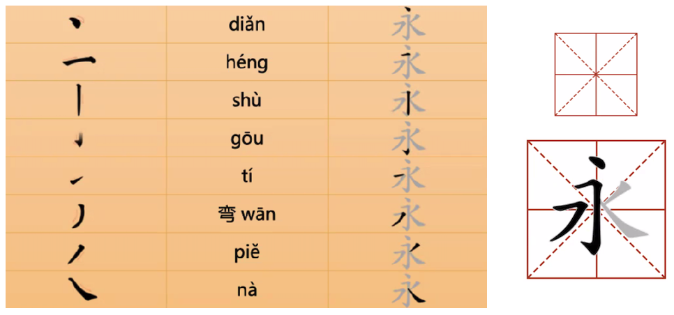

# Suplemento
*Notas de estudo organizadas por Gustavo Oliveira*

-- 

## Os 8 traços do _yǒng_ ("para sempre") e o "quadrado do caracter _tián_ ("campo")"

- Os chineses antigos treinavam a caligrafia através da escrita do caracter 永 [yǒng], que contém todos os oito traços básicos do chinês.
- O "quadrado do caracter tián", 田字格 [tiàn zì gé], é a estrutura básica de aprendizagem de caracteres, que se baseia no caracter 田. 

- Descritivo dos 8 traços

|hànzì | pinyin | nome |
|---|---|---|
|点 |diǎn| ponto |
| 横 | héng | horizontal |
| 竖 | shù | vertical|
| 钩 | gōu |gancho|
| 提 | tí | diagonal ascendente para a direita |
| 弯 | wān | curvado|
| 弯 | piě | diagonal descendente para a esquerda |
| 捺 | nà | diagonal descendente para a direita |

### Variantes de traços

- Há 32 variantes para os traços (vide tabela abaixo). Porém, vários deles, embora possuam _code points_ no Unicode, não são imprimíveis em tela por falta de fonte. Em geral, vale a pena aprender os 8 traços (alguns parecem usar _tí_ e _piě_ como se fossem apenas um radical)

## Exercício: caracteres para treinamento 

您 葡 哪 都 语 / nín pú nǎ dū yǔ 

## Tabela de radicais e de caracteres

> _Radicais_ constroem _caracteres_ e _caracteres_ constroem _palavras_.

- A lista oficial de radicais é encontrada no site do [Ministério da Educação da China](www.moe.gov.cn), buscando por: 汉字部首表, ou ([aqui](http://www.moe.gov.cn/ewebeditor/uploadfile/2015/01/13/20150113090108815.pdf)).
- A tabela oficial de caracteres (通用规范汉字表) é encontrada [aqui](https://www.gov.cn/gzdt/att/att/site1/20130819/tygfhzb.pdf).

## Limiar de aprendizagem

- 3500 caracteres (avançado) 
- 6500 caracteres (fluente)

## Poema para estudo

- Versão em inglês encontrada [aqui](https://min.news/en/emotion/cbc46462a273cb1547fec8436dcaa342.html) (tradução deve ser verificada).

> **Send to Li Shaofu in Weicheng**
> Tang: Zhang Jiuling

> _See off Nanchang Wei, leave the pavilion west to wait for spring._

> _The wildflowers are exhausted, and the forest birds are still fresh._

> _Don't drink Qingmen Road, Guixuan Baimajin._

> _Knowing each other is not far or near, thousands of miles are still neighbors._

## Dicionários
- Oficiais
	- [Xiandai Hanyu Cidian](https://www.amazon.com.br/Contemporary-Chinese-Dictionary-Xiandai-Cidian/dp/7100034779)
- Extraoficiais
	- [Youdao](http://dict.youdao.com)
	- [Zdic Collection](https://www.zdic.net)

## Artigos
- Perfil Medium de [Jon Wong](https://jhannwong.medium.com)
	- Sequência de 4 artigos sobre escrita chinesa começando [aqui](https://medium.com/@jhannwong/learning-chinese-writing-made-easy-f352be930be7).
	- Referência para [3500 caracteres](https://jhannwong.medium.com/learn-3500-chinese-characters-in-one-week-f1fc00067450). 
